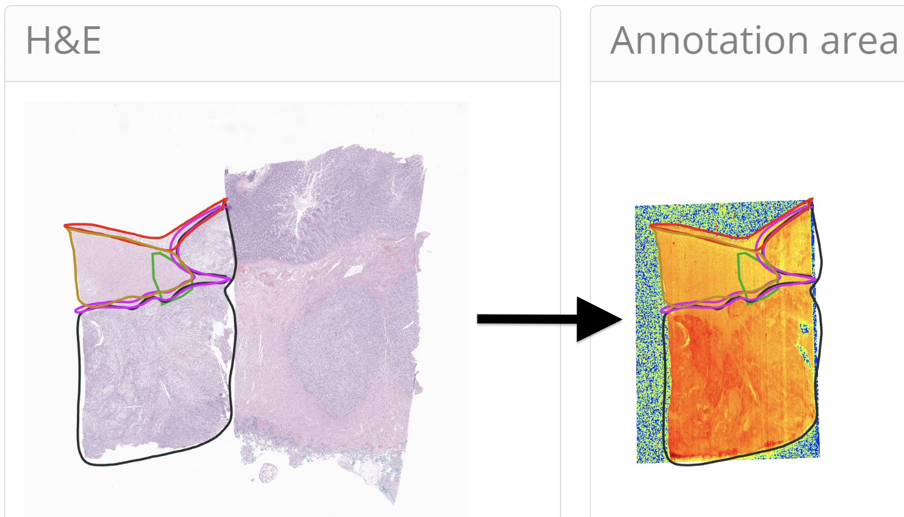

## TRACE: Tissue Region Analysis through Co-registration of Elemental Maps



### Overview
TRACE is an advanced containerized web application designed for the detailed analysis of tissue regions by co-registering Whole Slide Images (WSI) with elemental maps. This tool enhances the precision of metal bioaccumulation studies by allowing targeted analysis within specific tissue areas, integrating seamlessly with hematoxylin and eosin (H&E) slides for effective comparison across various pathological conditions.

### Features
- **Detailed Elemental Profiling**: Targets specific tissue areas for precise metal bioaccumulation analysis.
- **Co-registration with WSI**: Facilitates effective comparison and analysis by integrating with H&E slides.
- **Interactive Web Application**: Includes features like real-time annotation editing, advanced statistical tools, and comprehensive data export functionalities.
- **Enhanced Spatial Analysis**: Supports the comparison of elemental abundances across annotated tissue structures and integrates with other spatial data types.

## Setup Instructions

### Conda Environment Setup

1. **Create and activate a conda environment:**

   ```bash
   conda create --name trace python=3.11
   conda activate trace
   ```

2. **Install necessary packages:**

   ```bash
   conda install -c conda-forge libvips openslide glib # FOR MAC/LINUX
   conda install -c conda-forge openslide-python glib gcc # FOR WINDOWS
   ```

3. **Install TRACE application:**

   ```bash
   pip install git+https://github.com/jlevy44/trace_app
   ```

4. **Using non-standard WSI formats:**

   TRACE only supports the following image formats: [".tif", ".tiff", ".ome.tif", ".ome.tiff", ".dng", ".zif", ".stk", ".lsm", ".sgi", ".rgb", ".rgba", ".bw", ".img", ".oif", ".oib", ".sis", ".gel", ".svs", ".scn", ".bif", ".qptiff", ".qpi", ".pki", ".ndpi", ".avs"]. To load other formats (e.g., .lof) you will need to convert the image to ome.tiff format. 
   
   First, install bftools into your trace conda environment:
   ```bash
   conda activate trace
   conda install ome::bftools
   ```

   Then, run bfconvert to create the ome.tiff file:
   ```bash
   set BF_MAX_MEMORY=12g # Windows
   export BF_MAX_MEMORY=12g # Mac/Linux
   bfconvert -tilex 2048 -tiley 2048 /original_path/image_file.lof /new_path/image_file.ome.tif
   ```

### Running the Desktop Application

- **Using the Desktop App:**

  After setting up the environment, you can run the desktop application which will help configure project folders (and can run TRACE):

  ```bash
  trace_desktop_app
  ```

  Ensure that the project directories are created and contain at least one WSI and one XLSX file in the `upload_dir`.

  Example directory structure:
  ```
  project_dir/
  ├── workdir/
  │   └── data/
  ├── upload_dir/
  │   ├── example.svs
  │   └── example.xlsx
  └── tmpdir/
  ```

- **Running TRACE with a specific port:**

  You can also run TRACE directly with a specified port:

  ```bash
  cd /project_dir/ 
  trace --port {PORT}
  ```

### Docker Instructions

If Docker is installed, you can run the application using Docker:

1. **Navigate to the project directory:**

   Before running the Docker command, ensure you are in the project directory:

   ```bash
   cd /path/to/your/project_dir
   ```

2. **Download and run the desktop app directly:**

   ```bash
   wget https://raw.githubusercontent.com/jlevy44/trace_app/main/trace_app/run_trace_desktop_app.py
   python run_trace_desktop_app.py
   ```

   Alternatively you can use the launcher provided by the Python installation:
   ```bash
   trace_desktop_app
   ```

   This will automatically handle Docker operations.

3. **Alternatively, pull the Docker image:**

   ```bash
   docker pull joshualevy44/trace_app:latest
   docker run --rm -it -p {PORT}:{PORT} \
     -v "$(pwd)/workdir:/workdir" \
     -v "$(pwd)/upload_dir:/upload_dir" \
     -v "$(pwd)/tmpdir:/tmpdir" \
     -v "$(pwd):/pwd" \
     joshualevy44/trace_app:latest sh -c 'cd /workdir && trace --port {PORT}'
   ```

### Singularity Instructions (for HPC)

For High-Performance Computing (HPC) environments, you can use Singularity:

1. **Navigate to the project directory:**

   Before running the Singularity command, ensure you are in the project directory:

   ```bash
   cd /path/to/your/project_dir
   ```

2. **Pull the Singularity Image File (SIF):**

   ```bash
   singularity pull docker://joshualevy44/trace_app:latest
   ```

3. **Run the application using Singularity:**

   ```bash
   singularity exec --bind "$(pwd)/workdir:/workdir" \
     --bind "$(pwd)/upload_dir:/upload_dir" \
     --bind "$(pwd)/tmpdir:/tmpdir" \
     trace_app_latest.sif trace --port {PORT}
   ```

Replace `{PORT}` with the desired port number you wish to use.
